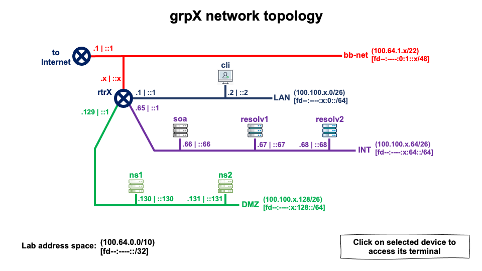
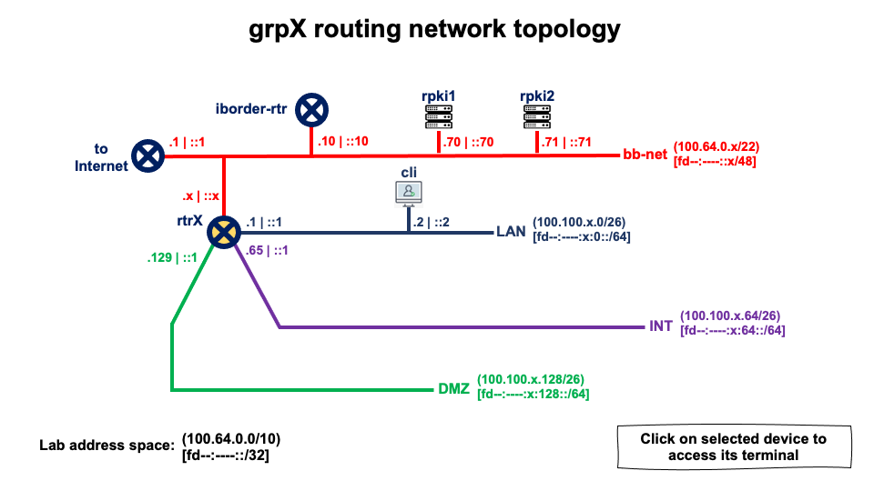
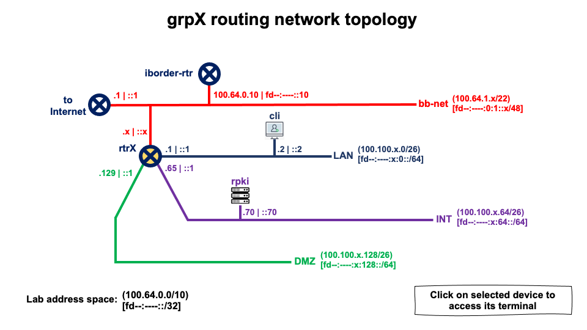

# Lab setup guide

Welcome to the lab setup guide!

The following instructions should help you to setup and take down a lab.

> [!NOTE]
> Don't hesitate to ask for help. Nico and Ulrich are always happy to help a colleague. Usually use Slack but in urgent cases a phone call is a faster way to get help.

# Lab Features

- All group name servers are reachable from the internet (through dnsdist in container dnsdist)
- dnsviz.net and zonemaster.net can be used to test group zonemaster
- DS records can be submitted manually on the group web page
- CDS records are scanned and will be submitted automatically

# Step-by-step guide

- Log into AWS
- Goto S3 and find the bucket to which the whole repository is uploaded to
- Copy the URL of the lab-ec2.yaml file 
- Goto CloudFormation
- Click on "Create stack"
- Choose "with new resources (standard)"
- Paste in the URL from above
- Click on "Next"
- Enter Stack name - Please follow the convention    
  LAB-\<DATE\>-\<LOCATION\>, e.g. LAB-20250101-STOCKHOLM
- Enter DnsName - needs to be a valid domain name, usually we use location (city or country) name for that
- Value for DnsParent should not be changed unless you really need to use another domain for the lab.
  Please be aware that the zone must already exist in your AWS account and must be dnssec signed. And
  don't forget the dot at the end.
- Choose LabType - 1 = resolver, 2 = DNS, 3 = Router
- Do **NOT** change the value of LatestUbuntu, it is a magic AWS value
- Write in your own name as Owner
- Write in the number of groups you want to set up, between 3 and 64
- S3Bucket is the name of the S3 bucket from where all install files will be fetched. It should already 
  be filled in with the name of the bucket from where you got the URL for the CloudFormation template.
- labInstanceType is the type of the AWS EC2 machine this lab should use. Please see section [Select instance type]
- labSshKey is the SSH key used to log into the AWS EC2 instance. You should not change this unless you really
  want to run a private lab.
- Click on "Next"
- Scroll to the bottom of the page
- Check the the box "I acknowledge that AWS CloudFormation might create IAM resources with customised names."    
This is needed for the ec2 instance to access s3 and route53
- Click on "Next"
- Scroll to the bottom of the page
- Click on "Next"
- After around 5 minutes the stack creation should show "CREATE_COMPLETE"
- Wait approx. 30 minutes for all lab setup scripts to finish too.
- **DONE**

## Select Instance Type

Instance types defines cpu, memory and storage of the EC2 machine this lab will use.
Storage is automatically added by the CloudFormation template. So it is safe to chose a machine type 
without storage.

The default machine r4.xlarge has x86_64, 4 vcpu, 30.5GB memory, no storage

Not all instance types are available in all regions and even if they are supported in a region
they could be temporarily unavailable. 

Alternative types could be
- r5.xlarge
- r5a.xlarge
- r5b.xlarge
- r6a.xlarge

Requirements are x86_64, min 4vcpu, min 32GB memory. The lab uses a lot of memory and not so much cpu.

If you want to run more than 30 participants it is probably a good idea to level up too ??.2xlarge instance types.

For a full list of available instance types, please see https://docs.aws.amazon.com/ec2/latest/instancetypes/ec2-instance-regions.html

# Lab access

Follow the ***Prepare your laptop for lab access*** below.<br>
Then just type
```
ssh <DnsName>.<DnsParent>
```

> [!TIP]
> Prepare your laptop for lab access
> 
> Put the following in your `~/.ssh/config` file
> 
> ```
> Host *.te-labs.training
>	User ubuntu
>	IdentityFile ~/.ssh/id_te-lab.pem
> IdentitiesOnly yes
>	Port 8484
> ```
>
> Ask one of your colleagues for the `~/.ssh/id_te-lab.pem` file.

All labs use the same ssh key if not manually configured otherwise.

## Access to lab web

The web page of the lab can be reached at    
`https://<DnsName>.<DnsParent>`

For the group passwords, log into the web by ssh and type
```
cat grouppasswords.txt
```
# Lab life-cycle management

Please setup a new lab at least a week before your engagement.
Test the new lab for full functionality.

Then go to **AWS EC2** and stop the instance (it should have the same name as your lab). On the day of your engagement go back to **AWS EC2** and start the instance again.

> [!NOTE]
> This will save several hundred dollars in AWS fees.

> [!IMPORTANT]
> When starting the instance again allow several minutes for the instance to restart before ssh will be active again.


# Lab Take-down

Once you are done with your lab it is important to decomission it.
Please follow these "easy" steps:

- Log into AWS
- Goto Route53 
- Delete all RRs from the lab zone (except apex RRs)
- Goto CloudFormation
- Click on "Stacks" on the left hand menu
- Mark the button in front of your lab
- On the upper left hand choose "Delete"
- After approx. 5 minutes the stack should be deleted
- if the delete failed
  - Click on your lab
  - Click on "Retry delete" and choose the "Force delete" option
- **DONE**

# Feature Requests

Please submit as github issue.

# Network address plan

The lab uses the 100.64.0.0/10 address space from RFC 6598 "IANA-Reserved IPv4 Prefix for Shared Address Space".

There is a backbone to which all groups network interconnects: 100.64.0.0/22

Each goup has a router (rtrXXX) that interconects all it's sub-nets and to the backbone.
The default gateway that provides Internet conection is 100.64.0.1

Each group has a network prefix: 100.100.X.0/24
Then, within each group, prefix is splitted into 3 sub-networks:

- Clients network (**lan**): 100.100.X.0/26
- Internal servers network (**int**): 100.100.X.64/26
- Auth servers stuff network (**dmz**): 100.100.X.128/26

# Network setup for different lab types

## Lab type 1 (Resolver)

## Lab type 2 (DNS)


## Lab type 3 (Routing)



# AWS Integration

This repository aims to setup a full lab on an AWS EC2 instance. But just copying the 
`config/`and `scripts/` folders to a Ubuntu Linux machine should allow you to start the
lab on any other cloud service or on your own machine.

One integration will be harder to replace. This setup makes heavy use of AWS Route53
as a provider for DNS and DNSSEC. Additionally the DNSSEC automation uses an integration
to Route53. 

## If you fork this repository

This repository contains an automation that will upload new version automatically to an 
AWS S3 bucket. For this, it uses three secrets which you will have to configure for your 
fork.

Github Secrets:
- `ACCESS_KEY` the AWS ACCESS KEY
- `SECRET_ACCESS_KEY` the AWS SECRET ACCESS KEY
- `DESTINATION_BUCKET` the AWS S3 bucket to which the main branch will be copied

Github Repository Variables:
- `SSH_PUBLIC_KEY` the ssh key to log into your ec2 instance
- `KSK_ARN`the AWS ARN of the key to be use for DNSSEC signing

In any case, the CloudFormation (CF) template does download the contents of the repository
from a S3 bucket. The name of the bucket will be injected in the CF template by the 
github automation.

> [!NOTICE]
> The key for DNSSEC signing must be created in Virginia (us-east-1), ECC_NIST_P256, Sign and verify.

# Development

All development should be done in its own branch. Branches are automatically uploaded 
to a S3 bucket named `DESTINATION-BUCKET`-<branch>. Please make sure your 
branches are named in all lower case a-z0-9, no dashes, no underscores. And make sure 
such a bucket actually exists in your AWS account.

Copy the URL of the `lab-ec2.yaml` file in your branch bucket and use it to start a new lab
instances.

