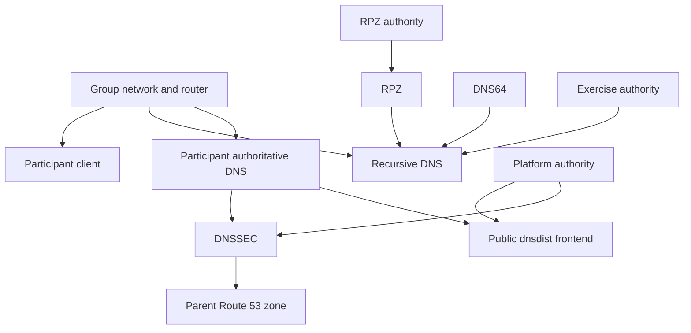

# DNS Capabilities

**Status:** In Review

**Last Updated:** 2026-08-31

---

# Purpose

This document describes the DNS training capabilities implemented or planned in OCTO-TE Labs and the architectural relationships among them.

The current capability taxonomy is:

```text
DNS
  - Recursive
  - Authoritative
  - DNSSEC
  - Monitoring
  - Universal Acceptance
```

The current numeric Lab Types are implementation profiles. They are not the long-term capability interface.

---

# Capability Model

A DNS capability is not always represented by one container. It can depend on:

- shared platform services;
- participant containers;
- host publication services;
- exercise activation scripts;
- external validation tools;
- DNSSEC state in the parent Route 53 zone.

The architecture distinguishes:

```text
platform services
exercise services
participant exercise roles
```

This separation prevents the public platform zone, intentionally unusual exercise zones, and participant-managed zones from sharing one authoritative daemon.

---

# Shared DNS Roles

| Role | Container | Responsibility |
|---|---|---|
| Public frontend | `dnsdist` | receives public UDP/TCP DNS and dispatches queries |
| Platform authority | `ns1` | serves and signs `<DOMAIN>` |
| Exercise authority | `auth-exercise` | serves `internal.` and special exercise zones |
| RPZ authority | `auth-rpz` | serves the `rpz.` policy zone |

The shared services are created for all current Lab Types.

---

# Recursive DNS Capability

## Participant roles

| Container | Intended software |
|---|---|
| `grpN-resolv1` | BIND |
| `grpN-resolv2` | Unbound |
| `grpN-cli` | query and troubleshooting workstation |

The platform deployment creates the containers and topology. The instructor activates the participant DNS software later with:

```bash
cd /root/scripts
./do-dns-lab.sh <group-or-all>
```

## Training scope

The recursive capability supports work on:

- iterative resolution;
- forwarding and recursion policy;
- cache behavior;
- negative caching;
- DNSSEC validation;
- resolver troubleshooting;
- RPZ;
- DNS64 exercises;
- comparison between BIND and Unbound.

## Shared dependencies

Recursive exercises depend on:

- `auth-exercise` for normal and intentionally unusual authoritative targets;
- `auth-rpz` for policy-zone transfer;
- the group router and internal network;
- Internet egress for real-world resolution and package installation.

## RPZ

`resolv1` obtains `rpz.` as a secondary zone from `auth-rpz` and applies response policies. Verified exercise behaviors include:

- NXDOMAIN;
- NODATA;
- local data;
- DROP;
- passthrough;
- TCP-only behavior.

The RPZ authority is deliberately separate from `auth-exercise`.

---

# Authoritative DNS Capability

## Platform authority

`ns1` is the authoritative source for the lab platform zone:

```text
<DOMAIN>
```

It provides:

- apex A and AAAA;
- apex NS;
- `ns1` A and AAAA;
- `webssh` A and AAAA;
- IPv4-only and IPv6-only exercise names;
- group NS delegations;
- dynamically-updated group DS records.

It is authoritative-only and does not provide recursive service.

## Exercise authority

`auth-exercise` serves:

```text
internal.
badnsname.internal.
evilnsip.internal.
```

One container holds multiple addresses so the exercises can represent different authoritative endpoints without multiplying shared containers.

## Participant authoritative roles

For profiles with `StudentAuth=YES`:

| Container | Intended role |
|---|---|
| `grpN-soa` | primary/SOA server using BIND |
| `grpN-ns1` | BIND secondary |
| `grpN-ns2` | NSD secondary |

The participant zone is:

```text
grpN.<DOMAIN>
```

The exercise activation script installs and configures the daemons after platform provisioning.

## dnsdist routing

For an enabled group authoritative capability:

```text
DS query for grpN.<DOMAIN>
    -> auth-platform

other query at or below grpN.<DOMAIN>
    -> grpN pool
```

Each group pool currently contains four objects:

- `grpN-ns1` over IPv4;
- `grpN-ns1` over IPv6;
- `grpN-ns2` over IPv4;
- `grpN-ns2` over IPv6.

For resolver-only profiles, these group pools are not generated.

The platform zone still generates group NS delegations independently of `StudentAuth`; aligning those delegations with the capability flag is a hardening task.

---

# DNSSEC Capability

DNSSEC exists at two related levels.

## Platform-zone DNSSEC

The platform zone uses:

```text
dnssec-policy default
```

in BIND.

The deployment:

1. waits for the platform DNSKEY;
2. extracts the key-signing DNSKEY;
3. computes SHA-256 DS data;
4. performs an UPSERT in the parent Route 53 zone;
5. waits for the Route 53 change to become `INSYNC`.

The DS is created outside native CloudFormation record resources. A CloudFormation custom resource removes it during stack deletion.

External validation should confirm the AD flag:

```bash
dig @1.1.1.1 +dnssec +adflag <DOMAIN> SOA
dig @8.8.8.8 +dnssec +adflag <DOMAIN> SOA
```

## Participant-zone DNSSEC

The participant materials support:

- DNSKEY and DS inspection;
- manual signing;
- automatic signing;
- ZSK and KSK rollover;
- secure and insecure delegation states;
- CDS-driven DS automation.

The host cron configuration runs DS/CDS automation each minute.

The currently implemented automation is CDS-oriented. Documentation must not claim complete CDNSKEY processing unless that path is separately implemented and tested.

---

# DNS64 and NAT64

DNS64 is a resolver exercise capability. NAT64 is currently created at the host layer for every profile through TAYGA.

The current NAT64 prefix is:

```text
64:ff9b::/96
```

The long-term design should make DNS64/NAT64 explicit capabilities so they can be enabled only when required.

---

# DNS Monitoring Capability

The current platform does not yet provide a dedicated monitoring subsystem.

Available evidence sources include:

- BIND journals;
- Unbound logs and control tools;
- NSD control/status;
- dnsdist logs and service state;
- `dig`;
- DNSViz;
- Zonemaster;
- Route 53 state;
- external DNSSEC-validating resolvers.

This is operational visibility, not a complete monitoring capability. A future monitoring capability should define:

- health checks;
- metrics;
- retention;
- alerts;
- participant-safe views;
- scale impact.

---

# Universal Acceptance Capability

Universal Acceptance, IDN, and EAI are part of the agreed DNS capability taxonomy, but the current platform does not yet expose a dedicated UA deployment profile or service set.

Future implementation may require:

- IDN-aware zones;
- Unicode and A-label/U-label examples;
- EAI-capable mail components;
- application acceptance tests;
- participant datasets and validation tools.

Until those components exist, UA remains a future capability rather than a verified current feature.

---

# Security and Publication Boundaries

The public DNS frontend rejects:

- NOTIFY;
- UPDATE;
- AXFR;
- IXFR;
- CHAOS-class queries.

This protects the public dispatch layer while participant exercises remain reachable through their intended paths.

Zone transfers needed for exercises occur on internal group networks rather than through the public frontend.

---

# Capability Dependencies



---

# Current Profile Coverage

| Capability | Type 1 | Type 2 | Type 3 | Type 4 |
|---|---:|---:|---:|---:|
| Recursive topology | Yes | Yes | Intended | Intended |
| Participant authoritative topology | No | Yes | Defective flag mapping | Intended |
| Platform DNSSEC | Yes | Yes | Intended | Intended |
| Participant DNSSEC exercises | Resolver subset | Yes | Requires retest | Requires retest |
| RPZ | Yes | Yes | Requires retest | Requires retest |
| DNS64/NAT64 | Host NAT64 present | Host NAT64 present | Present but unverified | Present but unverified |
| Monitoring | Basic operational evidence only | Basic operational evidence only | Not verified | Not verified |
| Universal Acceptance | Future | Future | Future | Future |

---

# Validation State

Verified in August 2026:

- platform authority over IPv4 and IPv6;
- public dnsdist routing;
- Lab Type 1 with no nonexistent participant-authority pools;
- Lab Type 2 with four backend objects per group;
- BIND and Unbound participant resolvers;
- BIND primary and secondary roles;
- NSD secondary;
- IPv4 and IPv6 authoritative responses;
- RPZ transfer and policy application;
- parent DS publication and cleanup;
- external DNSSEC validation;
- DNS names containing hyphens.

Routing-profile DNS combinations require regression testing after their known flag and RPKI defects are corrected.

---

# Known Gaps

- Group delegations are not conditioned on `StudentAuth`.
- SOA serials commonly begin at `1`.
- NAT64 is not capability-driven.
- Monitoring lacks a defined service architecture.
- UA is not implemented as a platform capability.
- External package sources are resolved during deployment.
- The participant exercise activation is separate from platform readiness and must be represented clearly in validation procedures.

---

# Review Status

**Current Status:** In Review

**Next Review:** After DNS hardening and capability-driven orchestration design.
