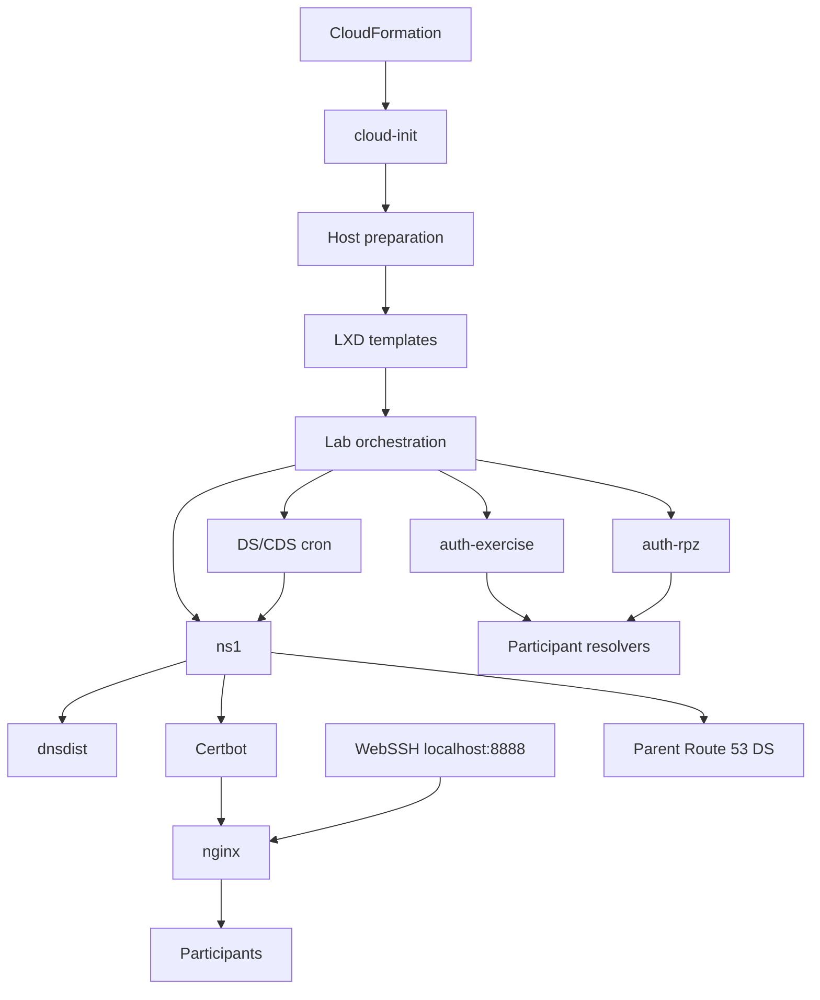

# Platform Services

**Status:** In Review

**Last Updated:** 2026-08-31

---

# Purpose

This document describes the shared services that support all or several OCTO-TE Labs capabilities.

Platform services are distinct from participant exercise roles. They provide deployment, publication, access, authentication, certificates, DNS dispatch, scheduled automation, and host networking.

---

# Service Inventory

| Service | Location | Responsibility |
|---|---|---|
| `cloud-init` | EC2 host | execute the initial deployment |
| LXD | EC2 host | container lifecycle, storage, profiles, and networks |
| nginx | EC2 host | main HTTPS site, group authentication, WebSSH proxy |
| WebSSH (`wsshd`) | EC2 host | browser terminal service on loopback TCP/8888 |
| Certbot | EC2 host | TLS certificate for `<DOMAIN>` and `webssh.<DOMAIN>` |
| PHP-FPM | EC2 host | dynamic group web pages |
| dnsmasq | EC2 host | temporary DHCP for container preparation; DNS disabled |
| TAYGA | EC2 host | NAT64 |
| iptables/ip6tables | EC2 host | NAT, public DNS DNAT, and VPN DNAT |
| cron | EC2 host | DS/CDS automation |
| `dnsdist` | LXD container | public DNS frontend |
| `ns1` | LXD container | platform authoritative DNS and DNSSEC |
| `auth-exercise` | LXD container | exercise authoritative zones |
| `auth-rpz` | LXD container | RPZ authoritative service |

---

# Cloud-Init and Deployment State

The first platform service encountered is `cloud-init`.

It runs the EC2 UserData chain:

```text
setup-host.sh
setup-containers.sh
setup-lab.sh --deploy
```

CloudFormation and `cloud-init` have separate states:

```text
CloudFormation CREATE_COMPLETE
    -> AWS resources exist

cloud-init status: done
    -> internal deployment completed
```

Readiness must be based on `cloud-init status --long`, not CloudFormation status alone.

Primary logs:

```text
/var/log/cloud-init-output.log
cloud-init status --long
```

---

# Web Publication

## nginx

nginx publishes two virtual hosts:

```text
https://<DOMAIN>
https://webssh.<DOMAIN>
```

The main site provides:

- lab landing page;
- per-group pages;
- topology diagrams;
- group-specific authentication;
- links to internal consoles;
- participant instructions.

The WebSSH virtual host reverse-proxies to:

```text
http://localhost:8888
```

Both virtual hosts redirect HTTP to HTTPS and enable HSTS.

## PHP-FPM

The main virtual host uses PHP-FPM through a Unix socket for generated group pages.

PHP-FPM is internal to the host and is not exposed through the AWS Security Group.

---

# WebSSH

The `wsshd` systemd service runs:

```text
/usr/local/bin/wssh --address=localhost --port=8888
```

Important boundaries:

- TCP/8888 listens only on loopback;
- nginx provides public HTTPS;
- WebSocket upgrade headers are forwarded;
- sessions use internal role addresses;
- the WebSSH connection limit is raised from its default to `200`.

The active configuration publishes WebSSH through the separate `webssh.<DOMAIN>` virtual host. The deployment generates `/etc/nginx/htpasswd/webssh`, but the current virtual-host template does not reference that file and contains no `auth_basic` directive. Therefore there is currently no nginx-layer authentication in front of the WebSSH application. SSH credentials used for the target session are a separate control and do not protect the public web endpoint itself. This is a high-priority hardening finding.

WebSSH is a host service rather than an LXD container.

---

# Authentication and Credentials

`passwords.sh` creates:

- one shared `labuser` password;
- one password per group.

The shared password can be supplied through the CloudFormation `labSinglePassword` parameter. If empty, a random value is generated.

The canonical credential file is:

```text
/home/ubuntu/grouppasswords.txt
```

nginx generates:

- one htpasswd file per group;
- one WebSSH htpasswd file containing `labuser` and the group users.

The per-group files protect group paths on the main site. The generated WebSSH htpasswd file is not referenced by the active WebSSH virtual host in the current configuration.

Container accounts commonly use:

```text
sysadm
rtradm
```

`hostX` is built with the fixed bootstrap credential `sysadm:icannws`, and `rtrX` adds `rtradm:icannws`. Copies inherit those accounts. Participant-role scripts rotate some role credentials, but the current shared DNS, global-validator, group-router `sysadm`, and border-router paths do not uniformly remove or rotate all inherited bootstrap credentials. Eliminating these fixed credentials is a high-priority hardening requirement.

Current scripts also print several generated passwords during deployment. Reducing secret exposure in logs remains required.

---

# Certificate Management

Certbot obtains or expands one certificate with names:

```text
<DOMAIN>
webssh.<DOMAIN>
```

The current implementation uses standalone validation.

Operational sequence:

1. determine whether the existing certificate includes both names;
2. stop nginx if it is active;
3. run Certbot standalone;
4. restart nginx only when it was previously active;
5. ensure the shared DH parameters file exists.

This ordering requires public TCP/80 and TCP/443 to reach the host.

The platform has been validated with DNS labels containing hyphens.

---

# Participant Instructions

The instruction pipeline:

1. downloads the configured ZIP archive;
2. extracts the participant content;
3. prepares a Jekyll site;
4. substitutes group and domain values;
5. builds static output;
6. installs one copy below each group web directory.

Current host dependencies include:

- Ruby;
- Bundler;
- Jekyll;
- build tools;
- pandoc;
- Markdown conversion tools.

The current redeploy output shows:

- Bundler root-user warnings;
- Sass deprecation warnings;
- repeated dependency resolution;
- large volumes of build output.

Caching and modernizing this toolchain are hardening tasks.

---

# Scheduled Automation

The host installs cron entries that run once per minute.

Current tasks include:

| Script | Responsibility |
|---|---|
| `dsupdate.pl` | process manually supplied DS data |
| `cdsupdate.pl` | discover participant CDS and update group DS records |
| `goinsecure.pl` | process requests to remove secure delegation |

The dynamic updates target the platform authority through an `nsupdate` key and a restricted BIND update policy.

Cron output is sent through the system logger.

---

# DNS Publication Services

## dnsdist

`dnsdist` is the public UDP/TCP DNS endpoint. Host DNAT directs public port 53 to the container.

It routes:

- unmatched platform-zone traffic to `ns1`;
- participant group traffic to a group pool when `StudentAuth=YES`;
- group DS queries back to the platform authority.

Its memory limit is raised to 8 GB.

## ns1

`ns1`:

- serves the platform zone;
- signs it with BIND DNSSEC policy;
- accepts restricted dynamic DS updates;
- provides the DNS names needed by HTTPS and WebSSH;
- generates the DS used in the parent Route 53 zone.

## auth-exercise and auth-rpz

These services keep exercise data separate from the production-like platform authority.

---

# Host Network Services

## dnsmasq

dnsmasq provides temporary DHCP on the backbone while container templates and copied instances obtain their initial connectivity.

Current configuration:

- listens on loopback and `100.64.0.1`;
- disables its DNS service with `port=0`;
- leases from `100.64.2.100` to `100.64.2.150`.

Final lab role addresses are static.

## NAT and firewall persistence

Host IPv4 NAT allows internal lab networks to reach the Internet.

`iptables-persistent` and `netfilter-persistent` store host rules.

Additional rules publish DNS to `dnsdist` and attempt to publish WireGuard to `iborder-rtr` in routing profiles.

The WireGuard configuration uses `VPNlistenPort`, but the current host DNAT add/delete commands are hard-coded to UDP/36456 and destination `100.64.0.10:36456`. A different configured listener therefore produces inconsistent forwarding and cleanup. The AWS Security Group also lacks WireGuard UDP ingress.

The current output warns about legacy iptables tables. A deliberate nftables/iptables strategy remains pending.

## NAT64

TAYGA creates the host NAT64 interface and routes. It is currently deployed for all profiles.

Its stop path contains an invalid `--rmmod` invocation and missing-resource errors. The service works during normal creation, but cleanup requires hardening.

---

# AWS Integration Services

The host AWS CLI is used for:

- downloading deployment files from S3 during UserData;
- locating the parent Route 53 hosted zone;
- publishing the lab DS;
- waiting for Route 53 changes.

CloudFormation Lambda custom resources perform:

- public IPv6 discovery;
- DS cleanup during stack deletion.

---

# Service Dependencies



---

# Lifecycle Rules

Start ordering:

```text
authoritative DNS backends
    -> dnsdist
    -> certificate
    -> nginx
    -> WebSSH and participant access
```

Stop ordering:

```text
public frontend
    -> authoritative backends
```

Internal `--deploy` deletes and recreates most shared services and web content while preserving the EC2 host and base templates.

CloudFormation deletion removes the EC2 host and invokes the external DS cleanup resource.

---

# Security Considerations

- WebSSH is bound to loopback and published only through nginx.
- The active `webssh.<DOMAIN>` virtual host has no nginx-layer authentication even though an htpasswd file is generated.
- Fixed bootstrap credentials inherited from `hostX` and `rtrX` are not uniformly removed or rotated across current roles.
- The public DNS frontend refuses update, transfer, notify, and CHAOS requests.
- `labSinglePassword` is handled with command tracing disabled in UserData.
- IAM permissions should remain limited to the branch S3 bucket and required Route 53 operations.
- Generated credentials and VPN values still require a full log-exposure review.
- Basic Authentication is appropriate for the current training environment but is not a substitute for centralized identity management.
- Runtime downloads create a software-supply-chain dependency.

---

# Operational Validation

```bash
systemctl is-active nginx
systemctl is-active wsshd
systemctl is-active dnsmasq
systemctl is-active tayga

curl -I https://<DOMAIN>
curl -I https://webssh.<DOMAIN>

lxc exec dnsdist -- systemctl is-active dnsdist
lxc exec ns1 -- systemctl is-active named
lxc exec auth-exercise -- systemctl is-active named
lxc exec auth-rpz -- systemctl is-active named
```

---

# Hardening Backlog

- make teardown idempotent;
- modernize the Jekyll/Sass dependency chain;
- avoid installing unchanged dependencies on every redeploy;
- reduce normal log verbosity;
- redact generated credentials;
- protect the active WebSSH virtual host with explicit authentication or another access-control layer;
- remove fixed bootstrap credentials and guarantee per-role rotation or account removal;
- define retry policy for external repositories;
- remove or justify legacy publication placeholders;
- clarify iptables versus nftables ownership;
- make NAT64 capability-driven;
- add health and metrics collection.

---

# Review Status

**Current Status:** In Review

**Next Review:** After the platform-service hardening phase.
