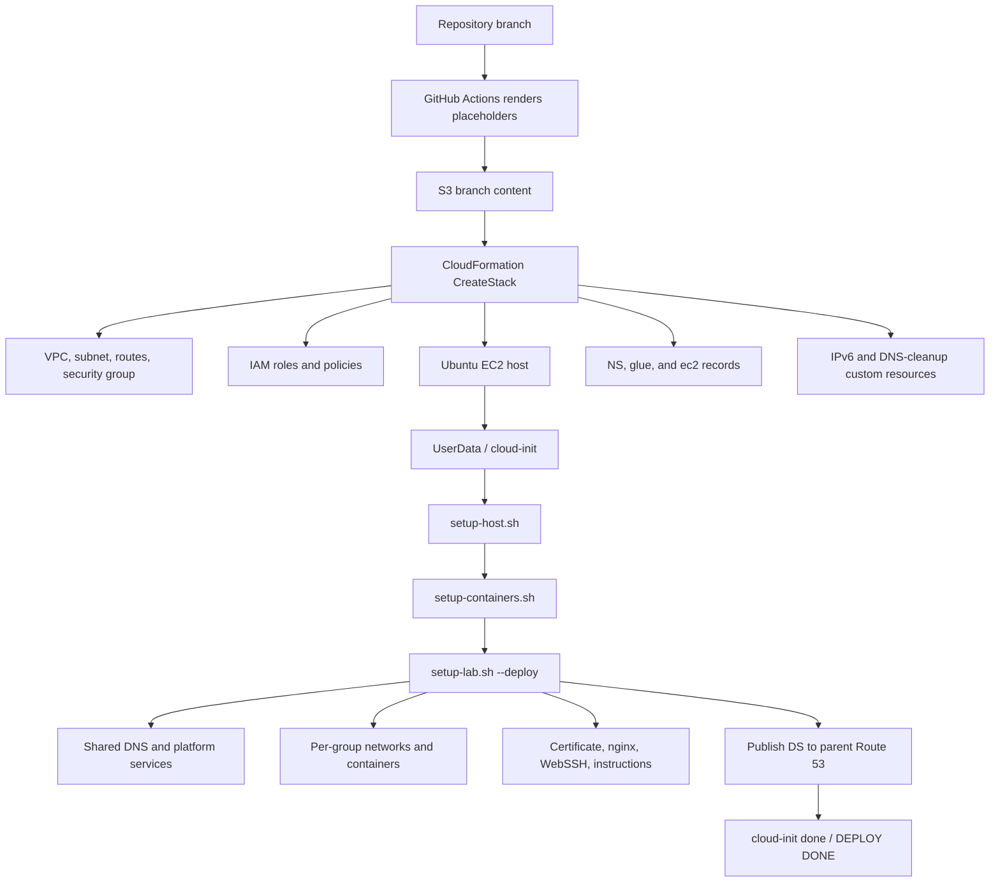
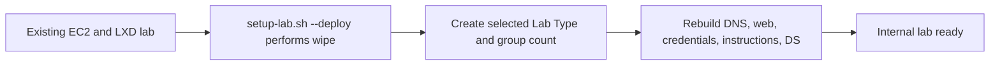
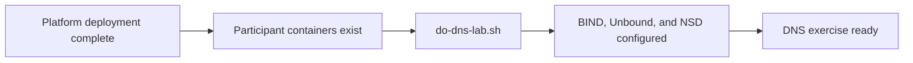
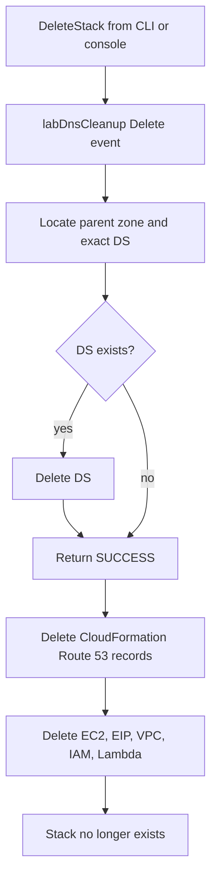
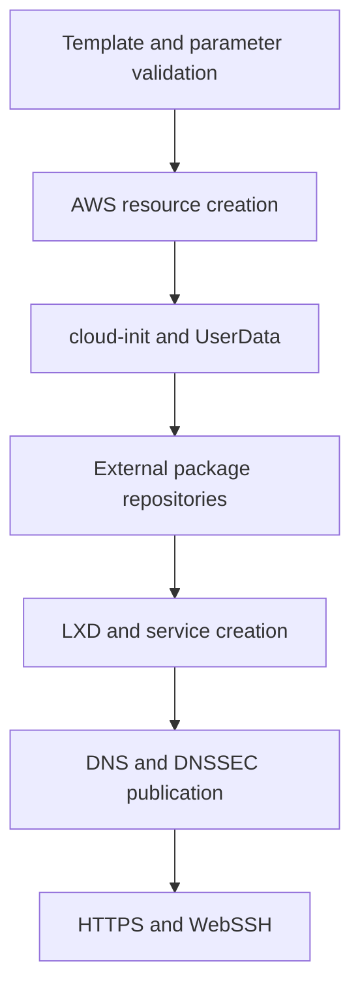

# Deployment Flow Diagram

**Status:** In Review

**Last Updated:** 2026-08-31

---

# Purpose

This document provides visual summaries of the OCTO-TE Labs deployment and deletion lifecycles.

The detailed narrative is in [`../architecture/02-deployment-flow.md`](../architecture/02-deployment-flow.md).

---

# Creation Flow



---

# Readiness Boundary

```mermaid
sequenceDiagram
    participant Operator
    participant CloudFormation
    participant EC2
    participant CloudInit
    participant Orchestrator

    Operator->>CloudFormation: Create stack
    CloudFormation->>EC2: Create instance and UserData
    CloudFormation-->>Operator: CREATE_COMPLETE
    Note over Operator,CloudFormation: AWS resources exist; lab may not be ready

    EC2->>CloudInit: Run final modules
    CloudInit->>Orchestrator: setup-host, templates, deploy
    Orchestrator-->>CloudInit: DEPLOY DONE
    CloudInit-->>Operator: status: done, errors: []
```

---

# Internal Redeployment



The EC2, VPC, EIP, IAM, and CloudFormation stack remain in place.

Command-line profile and group overrides are process-local and do not modify `deploy-parameters.cfg`.

---

# Participant DNS Activation



Platform-ready and exercise-ready are separate states.

---

# Deletion Flow



A real AWS API error returns failure rather than silently leaving DNS state behind.

---

# Failure Boundaries



Each boundary has a different source of truth:

| Boundary | Evidence |
|---|---|
| Template | CloudFormation validation |
| AWS resources | CloudFormation events |
| UserData | cloud-init status and log |
| Packages | APT/download output |
| LXD | LXD API and service state |
| DNS | Route 53 and external `dig` |
| Web | nginx state and `curl` |

---

# Review Status

**Current Status:** In Review

**Next Review:** After hardening introduces explicit health gates and retries.
