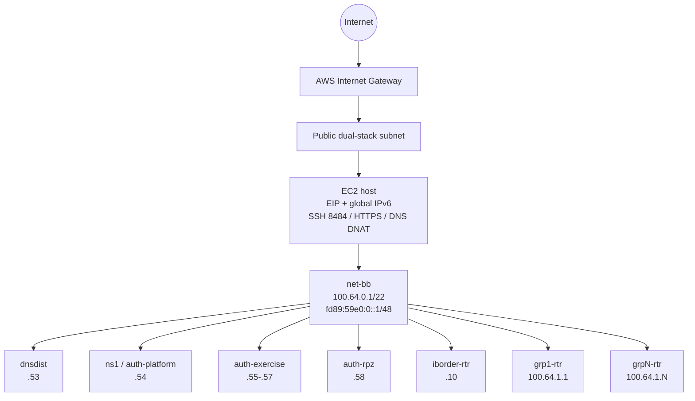
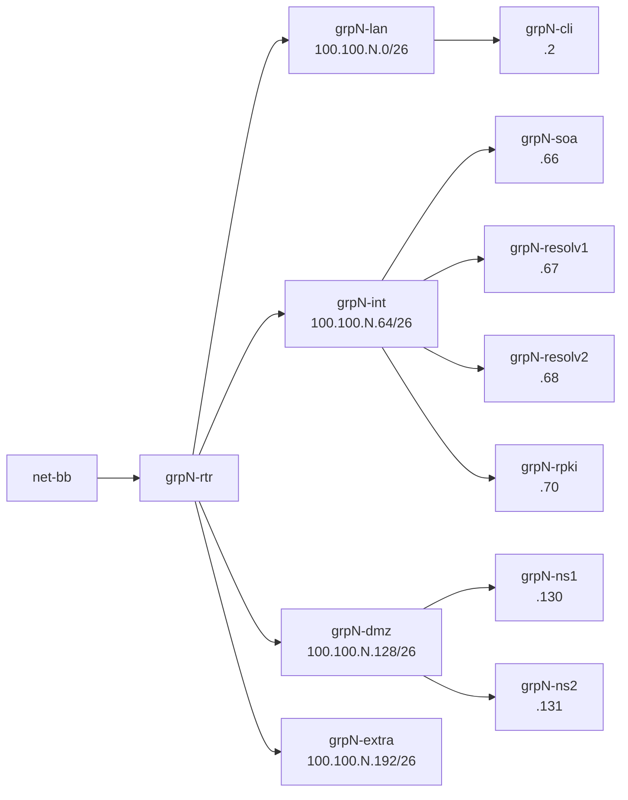
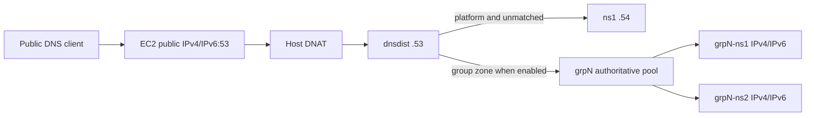
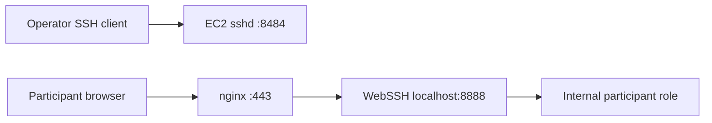
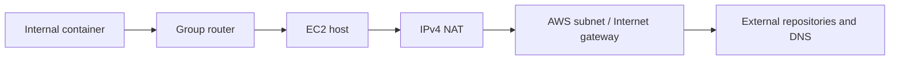

# Network Topology Diagram

**Status:** In Review

**Last Updated:** 2026-08-31

---

# Purpose

This document provides visual summaries of the current AWS, host, shared-service, and per-group network topology.

The detailed architecture is in [`../architecture/04-network-topology.md`](../architecture/04-network-topology.md). Exact addresses are in [`../reference/network-addressing.md`](../reference/network-addressing.md).

---

# Overall Topology

---

# One Group

Roles are created according to the selected Lab Type. The four bridges and router attachment exist for every current group.

---

# Public DNS Path

Group DS queries remain on the platform authority.

---

# Web and Access Path

---

# Egress Path

Shared backbone containers can reach the host directly without a group router.

---

# Address Legend

| Token | Meaning |
|---|---|
| `.1` | group LAN router |
| `.65` | group internal router |
| `.129` | group DMZ router |
| `.193` | group extra router |
| `.53` | shared dnsdist |
| `.54` | shared platform authority |
| `.55-.57` | exercise authoritative targets |
| `.58` | RPZ authority |

IPv6 follows the literal ULA patterns documented in the addressing reference.

---

# Current Constraints

- The fixed ULA is shared by all deployments.
- Host routes are prepared through group 200, but orchestration stops at 64.
- NAT64 is always created.
- WireGuard public ingress is incomplete.
- Group delegations exist even when participant authority is disabled.
- Routing and per-group RPKI paths need regression testing.

---

# Review Status

**Current Status:** In Review

**Next Review:** After dynamic ULA and routing-profile recovery.
